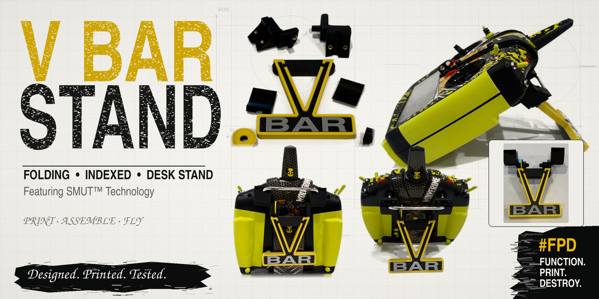
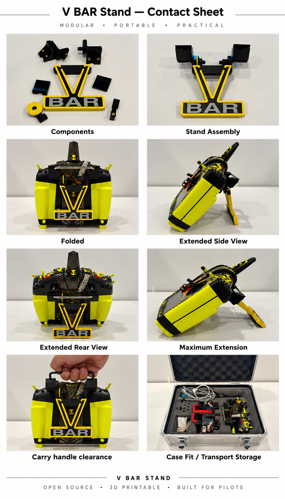

# Folding Indexed Stand for the VBar Transmitter

A folding, indexed-position desk stand for the VBar transmitter's curved metal carrying handle. The handle clamps are shaped for this radio; the two retained pivots and right-side spring-ball detent follow the proven **SMUT™** (**S**ide **M**ount **U**nit **T**echnology) architecture from the [iX14](https://github.com/kuato781/spektrum-ix14-stand) and [Spirit WAVE](https://github.com/kuato781/spirit-wave-stand) stands.

The stand folds against the back of the transmitter, keeps the carrying handle usable, and indexes into position with a replaceable detent ring. It mounts without permanently modifying the radio.

## Start here

- [Assembly instructions](documentation/assembly-instructions/assembly-instructions.md)
- [Printable three-stage assembly guide](documentation/exploded-view/VBar-assembly-guide.pdf)
- [Hardware buy list](buy-list/VBar-Stand-Buy-List.md)
- [Bambu Studio notes](bambu-studio-3mf/bambu-studio-profile.md)
- [Individual STL and SCAD files](stl-scad/)
- [Product photos](documentation/product-images/)

Ready-to-slice Bambu Studio projects are available for the [mounting hardware](bambu-studio-3mf/mounting-hardware/Vbar_all_mounting_hardware.3mf) and the [three-color stand](bambu-studio-3mf/stand/VBar-Stand.3mf). The ten individual STLs are also in `stl-scad/`.

## The VBar-specific fit

The handle rises at an unusual angle, so both case bodies and their matching caps follow the measured handle path. The channel was adjusted during physical fitting until the two sides held the stand square to the transmitter. The final clamp has a left and a right body **and** a left and a right cap; these are not interchangeable common caps.

**Left and right mean looking at the front of the radio.** A shallow `L` or `R` is etched into each matching case/cap. Those letters face **inward toward the middle of the handle** when installed.

The stand/header uses **40 mm pivot-mount centers**, a keyed block at each pivot, and a 66 × 18 × 7 mm header envelope. The replaceable detent ring and M4 spring-loaded ball plunger are on the **right** side.

The V/BAR stand is split into three aligned color parts:

1. `VBar-SMUT-Stand-HEADER-CORE.stl` - structural core and header;
2. `VBar-SMUT-Stand-WRAP.stl` - raised V and outside-edge wrap;
3. `VBar-SMUT-Stand-BAR.stl` - raised BAR lettering.

The pictured build uses a black core, yellow V/wrap, and silver BAR lettering. Import the three STLs **together as parts of one object at their shared origin** if building your own multicolor slice. The header is already included in the core; it is not an extra print.

## Important assembly notes

- Use **four M3 × 10 mm cap screws** (two per side). The Spirit WAVE instructions' M3 × 12 mm length does not apply here.
- Apply a **thin strip of double-sided tape to the tops of the handle** at the clamp locations before fitting the caps. Keep it narrow and away from the controls. The tested build used this to remove a little wiggle.
- Snug the cap screws enough to locate the clamps. The case/cap assemblies can still feel loose at this stage; the keyed stand/header squares and locks the two sides together.
- While tightening the stand mounting screws, **push the stand downward** so the header clears the lower corner of each case. Cycle the full folding motion afterward and confirm clearance on both sides.
- A visible gap at the cap/body seam is expected. Clamp securely without trying to force the halves flush.

The [assembly instructions](documentation/assembly-instructions/assembly-instructions.md) give the full sequence, insert locations, pivot hardware, and plunger adjustment.

## Product photos

These are photographs of the actual printed parts and radio: [components](documentation/product-images/01-components.jpg), [assembled](documentation/product-images/02-assembled.jpg), [folded](documentation/product-images/03-folded.jpg), [extended](documentation/product-images/05-extended.jpg), and [mechanical clearance](documentation/product-images/08-clearance.jpg). Additional side and transport views are in the [product-image directory](documentation/product-images/).

## Print files and source

The mounting-hardware 3MF and stand 3MF are separate so each can be printed or reprinted independently. The stand 3MF preserves the aligned multicolor parts. Review printer, build plate, material mapping, orientation, and sliced preview before printing.

Each final STL has a matching SCAD in `stl-scad/`. The SCAD files default to the exact final mesh. The three stand pieces additionally share editable OpenSCAD dimensions in `_vbar_stand_geometry.scad`; the clamp/pivot pieces are mesh-backed because the final case bodies combine measured clamp geometry with remeshed donor pivots. See [SCAD and STL notes](stl-scad/README.md) for what can be changed natively and for the original CadQuery build source.

The development loop was **measure → model → print → fit → revise**. The final parts shown here were physically printed and fitted. PETG was used for the documented build; verify your own prints, hardware and motion before relying on them.

## Repository map

| Path | Contents |
| --- | --- |
| `bambu-studio-3mf/` | Prepared mounting-hardware and multicolor stand projects, plus print notes |
| `buy-list/` | Inserts, screws, plunger, and other assembly supplies |
| `documentation/assembly-instructions/` | Detailed assembly sequence |
| `documentation/exploded-view/` | Printable three-stage guide and page images |
| `documentation/product-images/` | Photos of the physical build |
| `stl-scad/` | Ten final STL/SCAD pairs, stand assembly preview and source notes |

## Safety, affiliation and license

This is a desk/simulator stand, **not a replacement carrying handle**. Inspect parts, heat-set inserts and screws regularly, and confirm motion and stability before use. Read the [disclaimer](DISCLAIMER.md).

This independent community project is not affiliated with or endorsed by Mikado Model Helicopters. VBar and associated names and marks identify the compatible transmitter and remain with their respective owners.

The files are shared under [Creative Commons Attribution-NonCommercial 4.0 International](LICENSE): noncommercial copying, printing and modification with attribution and identification of changes. Commercial use requires separate permission from the creator.

AI assisted with the modeling and documentation through many print-and-fit iterations. The printer and the actual radio got the final vote. :-)
