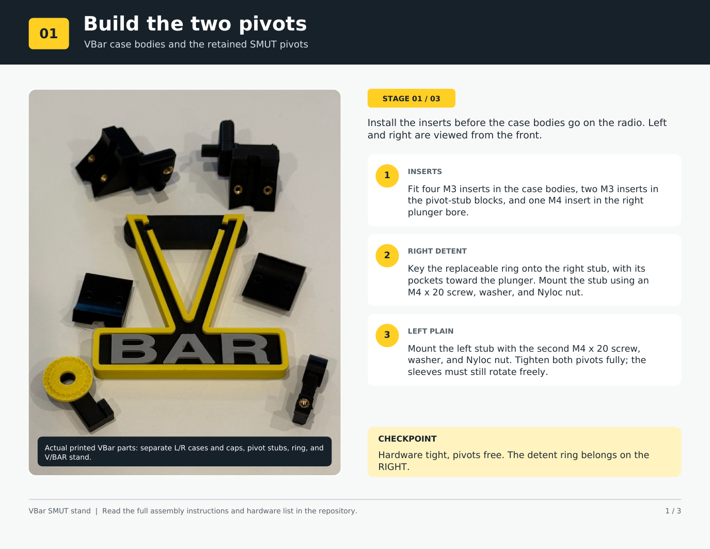
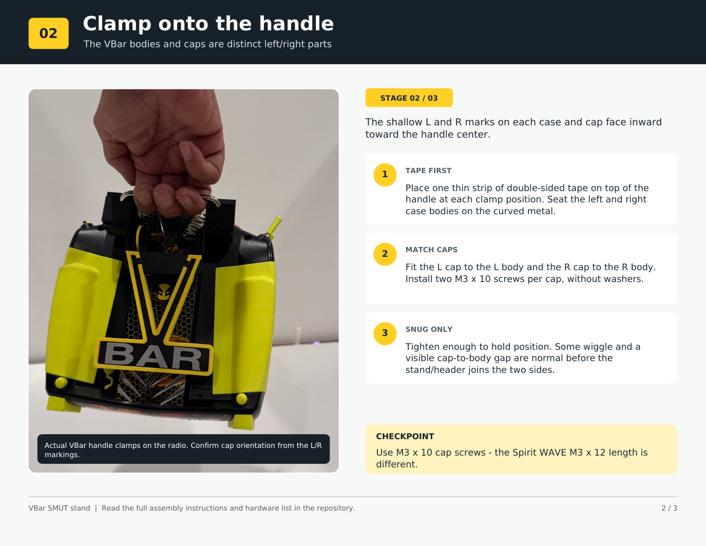
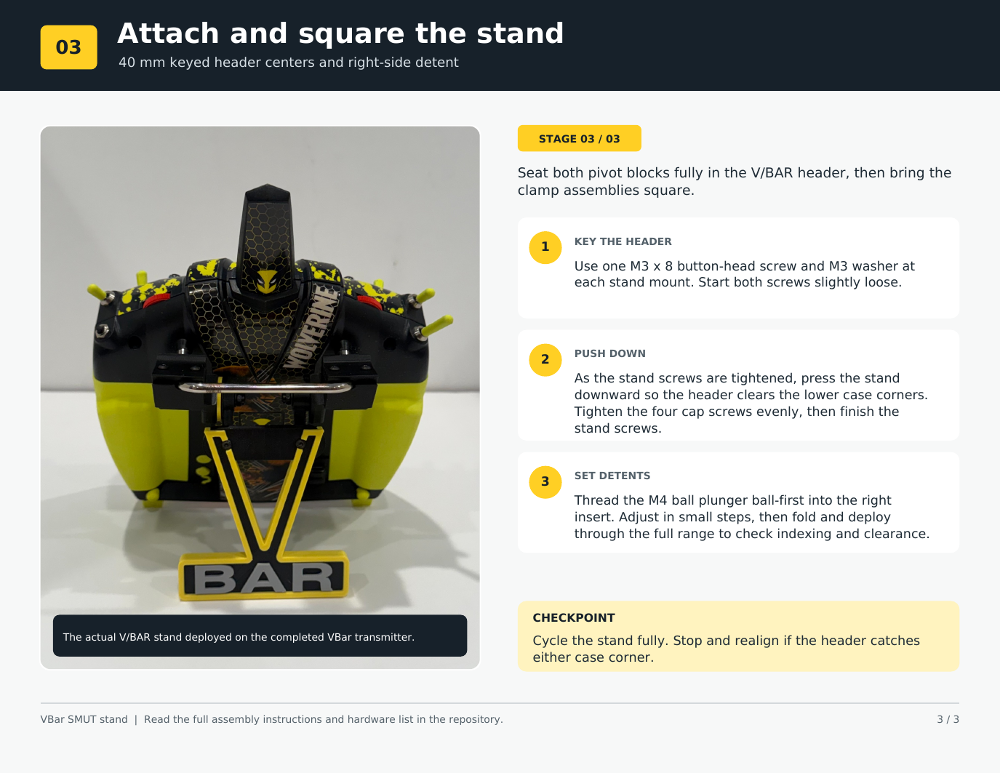

# VBar Stand - Assembly Instructions

[Download the printable three-stage guide (PDF)](../exploded-view/VBar-assembly-guide.pdf)

This is the VBar implementation of **SMUT™** - **S**ide **M**ount **U**nit **T**echnology. Separate left and right case assemblies clamp around the radio's curved carrying handle. Retained pivots connect them to the keyed V/BAR stand; the right pivot carries a replaceable detent ring and spring-loaded ball plunger.

**Left and right are always described while looking at the front of the radio.** Each body and its matching cap has a shallow `L` or `R`. The letters face **toward the inside of the handle**, not toward the outside edge of the transmitter. The caps are distinct left and right parts.

## Files and printed parts

For Bambu Studio, use the [mounting-hardware 3MF](../../bambu-studio-3mf/mounting-hardware/Vbar_all_mounting_hardware.3mf) and [stand 3MF](../../bambu-studio-3mf/stand/VBar-Stand.3mf). The ten final individual [STLs and matching SCADs](../../stl-scad/) are also provided. If importing stand STLs yourself, load the core, V wrap and BAR letters as aligned parts of one object.

| Quantity | Part |
| ---: | --- |
| 1 each | Left and right case body |
| 1 each | Matching left and right cap |
| 1 each | Left plain and right detent pivot stub |
| 1 | Replaceable detent ring (right side) |
| 1 assembly | V/BAR stand (structural core, colored V wrap, BAR letters) |

The stand's keyed header is already part of its structural core. It is **not** an additional printed component.

Use the [VBar hardware buy list](../../buy-list/VBar-Stand-Buy-List.md) for quantities and sizes. In particular, the four cap screws are **M3 × 10 mm**, not the M3 × 12 mm screws used on the Spirit WAVE.

## Before mounting: heat-set inserts

Install the inserts while the pieces are off the radio, using an aligned heat-set tool. Allow the plastic to cool completely before threading hardware into it.

- **4 × M3 inserts:** two cap-screw bores in each case body.
- **2 × M3 inserts:** one in each pivot stub's square stand-mounting block.
- **1 × M4 insert:** spring-ball-plunger bore in the right detent case body.

Check the printed M4 collar before pressing its insert. Clean up a rough opening lightly if necessary without enlarging the bore more than needed. Do not mistake the M3 cap-screw insert for the larger M4 plunger insert.

## Stage 1 - Build the left and right pivot assemblies

1. Identify the **right** case body, right detent pivot stub and replaceable detent ring. Seat the ring on the stub's keyed support face, aligning the asymmetric key. Its detent pockets must face the right case body's ball-plunger bore.
2. Slide the right pivot stub onto the right case body's pivot sleeve. Install an **M4 × 20 mm** pivot screw, M4 washer and M4 Nyloc nut.
3. Tighten the pivot hardware firmly. The sleeve shoulder should keep the stub free to rotate; the pivot must not depend on a loose screw for movement.
4. Assemble the left plain pivot stub to the **left** case body in the same way, with the second M4 × 20 screw, washer and Nyloc nut. The left has no detent ring.
5. Confirm both pivots rotate smoothly and the right ring remains fully keyed.

## Stage 2 - Fit the VBar handle clamps

1. Clean the two clamp locations on the metal handle. Apply a **thin, narrow strip of double-sided tape to the top of the handle** at each location. Keep the tape clear of the controls and visible handle opening.
2. Place each case body at its matching left/right location on the curved handle. Seat the handle in the shaped channel.
3. Match the **left cap to the left body** and the **right cap to the right body**. As viewed from the front, the shallow `L` and `R` marks on the cap and body face the **inside** of the handle.
4. Install **two M3 × 10 mm screws through each cap**. No washer is required under the cap screws. Tighten evenly only enough to hold the assemblies in position for the stand/header fit.

At this point the halves may feel a little wiggly even though the channel and screws are seated. That is expected on the tested build: the stand/header joins and squares the two sides. A cap-to-body gap is normal. Do not force the seam closed just to remove the visible gap.

## Stage 3 - Attach, square and tighten the V/BAR stand

1. Align the stand/header's two keyed recesses with the square mounting blocks on the pivot stubs. The centers are **40 mm apart**. Seat both blocks fully; the keys carry the twisting and shear loads.
2. Insert one **M3 × 8 mm button-head screw and M3 washer** at each header mount into the pivot block's M3 insert. Leave both stand screws slightly loose while aligning.
3. Bring the two handle clamps square and parallel with the header. Push the stand **downward as you tighten its mounting screws** so the header clears the **lower corner of each case body**.
4. Tighten the four M3 × 10 cap screws evenly until the clamps grip the handle securely. Keep the left/right body and cap aligned; a visible seam gap is acceptable. Then finish tightening both stand screws while maintaining the downward clearance.
5. Fold and deploy the stand through its complete travel. Check both lower case corners, the radio body and controls for rubbing or binding. If the header catches, stop and correct the alignment before using the stand.

## Set the right-side ball plunger

1. If desired, apply a tiny amount of **removable, non-permanent threadlocker** to the M4 insert threads using an awl or similar small tool. Keep it off the plastic and out of the plunger mechanism.
2. Insert the M4 × 0.7 spring-loaded ball plunger **ball end first** through its access bore and thread it into the right case body's M4 insert.
3. Adjust in small increments while folding and extending the stand. Stop when the ball seats positively in the ring's detents without making the pivot difficult to move.
4. Cycle repeatedly, confirming the ring stays fully seated and the plunger catches each intended position. Never use permanent threadlocker here.

## Final check

- `L`/`R` case bodies and caps match their respective sides and their letters face inward.
- The thin tape strips are under the tops of the handle at the clamp locations.
- All four M3 × 10 cap screws grip securely; the cap/body gaps need not close flush.
- Both M4 pivot screws, washers and Nyloc nuts are secure; both stubs rotate freely.
- The detent ring key is seated and its pockets face the right-side plunger.
- Both keyed stand blocks are fully seated and retained by M3 × 8 screws and washers.
- The stand/header clears both lower case corners throughout folding and extension.
- The ball plunger engages deliberately without binding or damaging the ring.
- The stand supports the radio on a stable desk and folds clear of controls and bodywork.
- The carrying handle remains usable; check transport-case fit separately.

Inspect the parts and hardware again after the first several use cycles and periodically thereafter. This is a desk/simulator stand, **not a replacement carrying handle**. See the [disclaimer](../../DISCLAIMER.md).
